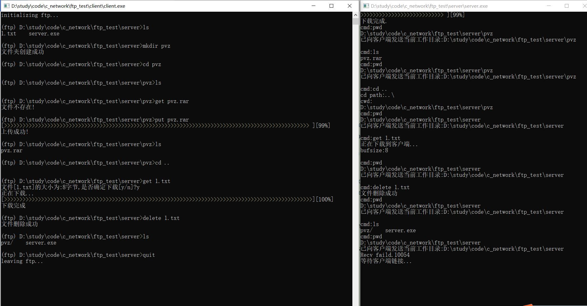

# Documentation

## Programming Ideas

PJ 1要求实现FTP的基本功能，包括客户端、服务端。因此，编码实现的重点工作量主要在于（1）客户端读入用户输入的指令，服务端接收请求，正确解析语义；（2）客户端与服务端间通信；（3）客户端、服务端执行指令内容

## Critical Code Analysis

### 基本架构

代码分为客户端和服务端两部分，分别放在`client`和`server`两个文件夹下。这两部分的`main`函数定义在`client/client.c`和`server/server.c`下，将分别编译，生成两个可执行文件。


```c
// client/command.h

# define CMD_NUM 8
# define CMD_GET  "get"
# define CMD_PUT  "put"
// omitting other cmd macro

# define IGNORE_ARGUMENT(cmd) #cmd " command should not have args. Redundant args are ignored.\n"

# define HELP_GET "get [remote_filename] Copy file with the name [remote_filename] \
from remote directory to local directory."
# define HELP_PUT "put [local_filename] Copy file with the name [local_filename] \
from local directory to remote directory."
// omitting other helping macro

typedef enum {
    SEM_GET, SEM_PUT, SEM_DEL, SEM_LS, SEM_CD, SEM_MKD, SEM_PWD, SEM_QUIT, SEM_ERR
} Semanteme;

typedef struct{
    Semanteme sem;
    short arg_num;
    const char* cmd;
    const char* help;
    void* (*function)(int, const char*);
} Command;
```

以用户端为例，上述定义了一系列针对字符串的宏、枚举变量，随后定义了Command结构体，用于描述用户命令。其包括五个成员，`sem`作为枚举变量，具有自解释性，表明命令的语义，同时也可具有index的功能；`arg_num`表明命令的参数个数；`cmd`为命令本身字符串，用于匹配语义；`help`是对命令的描述，用于用户输入不规范时打印提示信息；`function`是一个函数指针，为与命令一一对应的处理函数。这个处理函数接受两个参数，`int`类型对应网络资源，将在后文展开介绍，`const char*`为命令参数。如果一个命令不需要另加参数，那么调用具体函数时这一项会传入`NULL_STR`，即空字符串，具体函数内部不会用到第二个参数。

```C
// client/command.c

const Command commands[CMD_NUM] = {
    {SEM_GET, 1, CMD_GET, HELP_GET, client_get},
    {SEM_PUT, 1, CMD_PUT, HELP_PUT, client_put},
    {SEM_DEL, 1, CMD_DEL, HELP_DEL, client_delete},
    {SEM_LS, 0, CMD_LS, HELP_LS, client_ls},
    {SEM_CD, 1, CMD_CD, HELP_CD, client_cd},
    {SEM_MKD, 1, CMD_MKD, HELP_MKD, client_mkdir},
    {SEM_PWD, 0, CMD_PWD, HELP_PWD, client_pwd},
    {SEM_QUIT, 0, CMD_QUIT, HELP_QUIT, client_quit}};

const Command error_command = {SEM_ERR, 0, NULL_STR, "", client_err};
const Command null_command = {SEM_ERR, 0, NULL_STR, "", client_null};

Command get_command(const char *cmd) // 遍历commands，匹配命令
{
    if (!strcmp(cmd, NULL_STR))
        return null_command;
    for_i_in_range(CMD_NUM) if (!strcmp(cmd, commands[i].cmd)) return commands[i];
    return error_command;
}
```

以用户端为例，以上代码定义了涉及的命令。为了方便，额外定义了指令错误和无指令（如用户只输入空格、回车等）的处理函数。当用户输入不存在的指令时，客户端会遍历`commands`中的`cmd`和`help`段，给出提示信息；当用户输入空指令时，`client_null`不会做任何事。在`commands`中出现的八个`client_xx`函数是指令的处理函数，将在后文介绍。

`for_i_in_range`是我们自定义的宏，定义为

```C
# define for_i_in_range(x) for(int i = 0; i < (x); i++)
```

将多次出现。

```c
// client/client.c

int client_ftp(int sockfd){
    printf("\n(ftp) ");
    client_pwd(sockfd, NULL);
    printf(" > ");
    char input[MAX_LEN];
    scanf(" %256[^\n]", input);
    clear_buffer();
    printf("\n");
    Arguments args = split_string(input);
    Command cmd = get_command(args.argv[0]);
    //正常结束返回0，结束链接返回1，命令异常返回-1；
    int exitcode=cmd.function(sockfd, args.argc > 1 ? args.argv[1] : NULL);
    printf("\n",exitcode);
    return exitcode;
}


int main(int argc, char* argv[]){
    sockaddr_in addr = initialize();
 
    int sockfd = new_socket_conn(addr);
    while(client_ftp(sockfd)!=1);
    close_socket_conn(sockfd);
    Sleep(5000);
    return 0;
}
```

`client_ftp`代表一次用户输入与交互。其首先会打印用户工作目录（小组特色），随后接收输入，进行命令匹配，最后调用对应的处理函数。`main`函数中会不断重复这一过程，直到处理函数返回1，即用户退出。

服务端架构基本相同，不再赘述。  

### 客户端与服务端
客户端中，主体部分包括初始化socket，持续通过client_ftp函数接收用户输入的指令并发送给服务端，直到用户输入quit断开连接并退出客户端程序。  

与之对应的服务端中，在初始化socket后，connectToClient函数将监听来访的客户端并建立连接，连接成功后，持续调用listenToClient函数获取客户端发来的用户指令，直到收到quit指令后断开与客户端的连接，并继续等待。  
```c
// server/server.c
void connectToClient(SOCKET s) {
	
	//监听客户端链接
	if (0 != listen(s, 10)) {
		printf("listen faild:%d\n", WSAGetLastError());
		return NULL;
	}
	printf("等待客户端链接...\n");
	//有客户端链接，那么就要接受链接了
	struct sockaddr_in cliAddr;
	int len = sizeof(cliAddr);
	SOCKET clifd = accept(s, (struct sockaddr*)&cliAddr, &len);
	if (INVALID_SOCKET == clifd) {
		printf("accept faild:%d\n", WSAGetLastError());
		return NULL;
	}
	printf("客户端链接成功\n");
	printf("正在监听...\n");
	memset(arg, 0, sizeof(arg));
	strcpy_s(arg, strlen(".") + 1, ".");
	while(listenToClient(clifd)) {
	}
	return;
}
```

client_ftp的工作原理和代码已在上文给出，listenToClient与之类似。

### 文件上传与下载
客户端上传文件至服务端通过客户端函数client_put和服务端函数server_put联合实现。  

在客户端和服务端的头文件中都定义了Packet结构，用于保存文件信息
```c
// client/command.h
typedef struct {
    Msg msg;
    union MyUnion{
        struct {
            int fileSize;
            char fileName[MAX_LEN-sizeof(int)*2];
        }fileInfo;
        struct {
            int dataBufSize;
            int offset;
            char dataBuf[MAX_LEN-sizeof(int)*3];
        }dataInfo;
    };
}Packet;
//使用联合体结构，在告知服务器文件大小时使用fileInfo结构，在传输时使用dataInfo结构。
```
Packet结构体用于ftp中的get和put文件传输，msg代表客户端和服务端发送的信号，如FISEZIZE代表此次请求文件大小或此次传输内容中包含文件大小信息。当客户端或服务端得到msg后，通过msg决定下一步要做哪些操作。其中fileInfo结构体用于文件名和文件大小信息的传输，当确认文件大小和文件名后，进行文件内容传输，这时使用dataInfo结构体，每次dataInfo会告知本次包内真正发送的文件内容长度，即dataBuf的有效内容长度。offset告知传输文件进度，dataBuf内包含了真正的文件数据。

在用户输入'get xxx'指令后，服务端获取到等待上传的文件名，向客户端发送含有msg为FILENAME，联合体为fileInfo的packet，收到后客户端将文件大小写入fileInfo.fileSize，msg改为FILESIZE发送回服务端，服务端确认大小后将msg改为READYDOWN，文件开始上传。  

上传文件通过客户端的uploadToS函数和服务端的download函数实现，代码各自如下。
```c
// client/command.c
int uploadToS(SOCKET s, Packet* packet) {
    FILE* pread;
    //判断是否能打开文件
    errno_t err = fopen_s(&pread, packet->fileInfo.fileName, "rb");
    int fileSize = packet->fileInfo.fileSize;
    Packet sendPacket = { 0 };
    int bufSize = sizeof(sendPacket.dataInfo.dataBuf);
    char dataBuf[sizeof(sendPacket.dataInfo.dataBuf)] = { 0 };
    //printf("sendSize%d\n", packet->fileInfo.fileSize);
    sendPacket.msg = DOWNLOADING;
    //当文件大小大于buf时，分批传送
    int i = 0;
    long speed = 0;
    char pace[102] = { 0 };
    if (bufSize < fileSize) {
        sendPacket.dataInfo.dataBufSize = bufSize;
        for (i = 0; i < fileSize; i += bufSize) {
            sendPacket.dataInfo.offset = i;

            fread(&dataBuf, sizeof(char), bufSize, pread);

            memcpy(sendPacket.dataInfo.dataBuf, dataBuf, bufSize);
            if (send(s, (char*)&sendPacket, MAX_LEN, 0) <= 0) {
                printf("Send error: Failed to send to the client.%d\n", WSAGetLastError());
                fclose(pread);
                return -1;
            }
            int _speed = fileSize < 100 ? 100 : sendPacket.dataInfo.offset / (fileSize / 100);
            if (speed != _speed) {
                speed = _speed;
                for (int j = 0; j < speed; j++) {
                    pace[j] = '>';
                }
                printf("[%-100s][%d%%]\r", pace, speed);
                fflush(stdout);
            }
        }
        i = i - bufSize;
    }
    int lastBufSize = fileSize - i;
    sendPacket.dataInfo.dataBufSize = lastBufSize;
    fread(&dataBuf, sizeof(char), lastBufSize, pread);
    memcpy(sendPacket.dataInfo.dataBuf, dataBuf, sizeof(dataBuf));
    sendPacket.dataInfo.offset += lastBufSize;
    if (send(s, (char*)&sendPacket, MAX_LEN, 0) <= 0) {
        printf("Send error: Failed to send to the client.%d\n", WSAGetLastError());
        fclose(pread);
        return -1;
    }
    int _speed = fileSize < 100 ? 100 : sendPacket.dataInfo.offset / (fileSize / 100);
    if (speed != _speed) {
        speed = _speed;
        for (int j = 0; j < speed; j++) {
            pace[j] = '>';
        }
        printf("[%-100s][%d%%]\r", pace, speed);
        fflush(stdout);
    }
    printf("\n");
    printf("上传成功!");
    fclose(pread);
    return 0;
}
```
```c
// server/command.c
int download(SOCKET s, Packet* packet) {
    Packet recvPacket = { 0 };
    FILE* pwrite;
    char fileName[50] = { 0 };
    strcpy_s(fileName, strlen(packet->fileInfo.fileName) + 1, packet->fileInfo.fileName);
    int fileSize = packet->fileInfo.fileSize;
    char* fileBuf = calloc(sizeof(packet->dataInfo.dataBuf), sizeof(char));
    if (fileBuf == NULL) {
        printf("空间申请失败\n");
        return -1;
    }
    //判断是否能打开文件
    printf("fileName:%s\n", packet->fileInfo.fileName);
    errno_t err = fopen_s(&pwrite, fileName, "wb");
    if (pwrite == NULL) {
        printf("write file error..\n");
        return -1;
    }
    //接收从服务器发来的包
    printf("正在下载...\n");
    long speed = 0;
    char pace[102] = { 0 };
    while (recvPacket.dataInfo.offset <= fileSize) {
        if (recv(s, (char*)&recvPacket, sizeof(Packet), 0) <= 0) {
            printf("send error: %d", WSAGetLastError());
            fclose(pwrite);
            return -1;
        }
        //将包内内容复制到缓存
        memcpy(fileBuf, recvPacket.dataInfo.dataBuf, recvPacket.dataInfo.dataBufSize);

        //将缓存内容写入文件
        fwrite(fileBuf, sizeof(char), recvPacket.dataInfo.dataBufSize, pwrite);

        int _speed = fileSize < 100 ? 100 : recvPacket.dataInfo.offset / (fileSize / 100);
        if (speed != _speed) {
            speed = _speed;
            for (int j = 0; j < speed; j++) {
                pace[j] = '>';
            }
            printf("[%-100s][%d%%]\r", pace, speed);
            fflush(stdout);
        }
        //全部传输完成后退出
        if (recvPacket.dataInfo.offset == fileSize) {
            break;
        }
    }
    printf("\n");

    fclose(pwrite);

    free(fileBuf);

    return 0;
}
```
代码实现了将大文件分割为小的数据包进行传输，从而实现大文件的传输。  
文件下载与上传类似，通过客户端的client_get函数和服务端的server_get函数，以及其中的download和uploadToC实现。

### 其他
command.c中的其他函数命名为client_xxx和server_xxx（xxx为对应指令），相比于文件上传下载，结构类似且相对简单，在此不做赘述。
特别的，通过在client——ftp处调用client_pwd，可以直接实现将服务器当前所在位置输出在客户端命令行上，方便用户查看

## Screen shots



## Contributions

| 姓名   | 学号        | 分工                                                         | 贡献比例 |
| ------ | ----------- | ------------------------------------------------------------ | -------- |
| 陈思涵 | 20302010003 | 担任组长，负责Linux的FTP，支持局域网联机以及多client机制。   | 25%      |
| 赵方博 | 19307110084 | 负责Windows的FTP主体部分，支持所有文档中描述的基本功能，以及提供及选择使用基于Visual Studio的VC++平台开发API。 | 25%      |
| 戴圣九 | 20302010004 | Command Line Parser，文档框架撰写以及Git版本及分支管理，进度管理。 | 25%      |
| 钱成   | 20302010036 | 提供机架局域网测试，在无法大规模使用Debugger的情况下帮助进行可视化调试，撰写文档的主体部分。 | 25%      |

